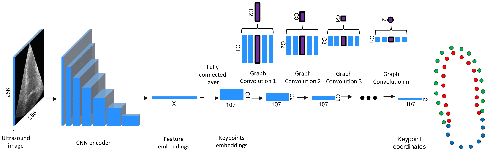
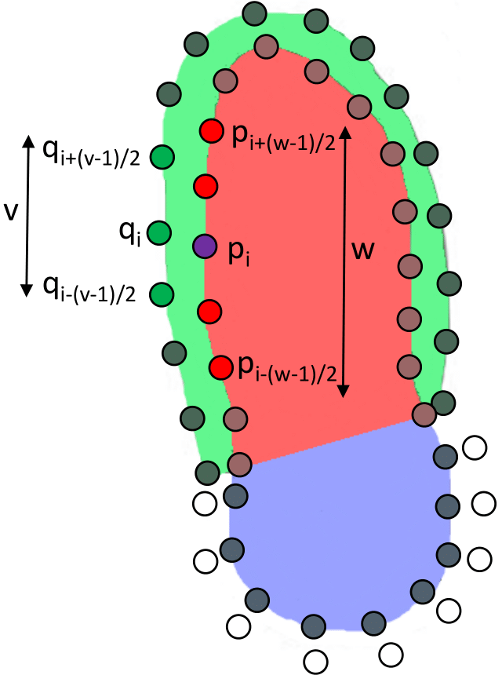
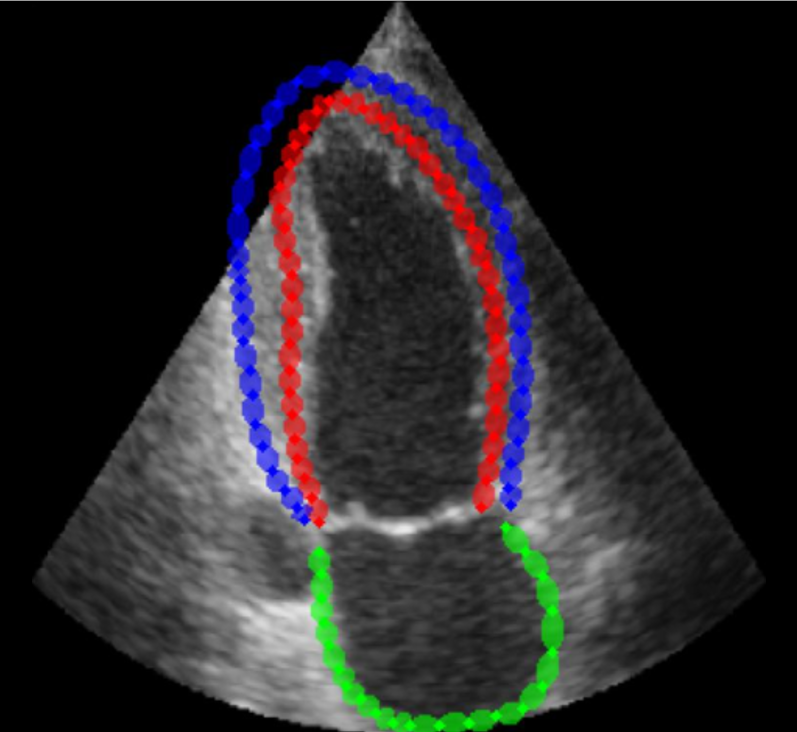
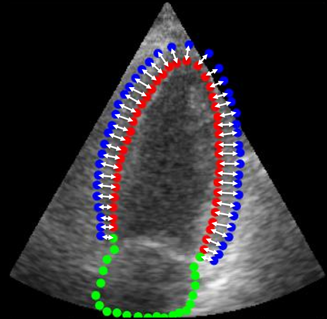

# Graph Based Segmentation

This repository contains code for using graph based architectures for
segmentation. The code is extracted as a modular entity and can be 
used directly in PyTorch. The code is based on the work "
[Towards Robust Cardiac Segmentation using Graph Convolutional Networks](https://arxiv.org/abs/2310.01210).". The code in this repository contains 
the isolated code for the arhictecture only, so you can insert it in any PyTorch framework.

For the full framework used in the publication, see https://github.com/gillesvntnu/GCN_multistructure

## Contents
[CNN_GCN.py](./CNN_GCN.py) contains the code for single structure segmentation architecture.

[GCN_multistructure.py](./GCN_multistructure.py) contains the code for multi structure segmentation architecture.

[GCN_multi_displacement.py](./GCN_multi_displacement.py) contains the code for multi structure segmentation with
displacement method architecture.

## Description

For a full description of the architecture, see the publication,
"
[Towards Robust Cardiac Segmentation using Graph Convolutional Networks](https://arxiv.org/abs/2310.01210).".

The architecture of the GCN. The CNN encoder transforms the input ultrasound image of width W and height
H to an embedded vector of size X. A dense layer transforms this embedding to an embedding in keypoint space, with 107
keypoints and C1 channels. The decoder consists of a sequence of graph convolutions over these keypoint embeddings. The
final outputs are the 2D coordinates of the keypoints in the image.

Multi-structure convolution. q1..n are zero-padded epicardium keypoints,
p1..n are endocardium and left atrium keypoints. 
The highlighted points are used as input
to update the embedding of the purple keypoint, with w the
primary receptive field and v the secondary receptive field.

Example output of the double ring model (GCN_multistructure.py). 
The output of the model are the x and y coordinates of the keypoints.
The keypoints are ordered in two concentric rings.
The inner ring consists of the left ventricle (red) and left atrium (green), the outer ring consists
of the epicardium (blue)

Example output of the displacement model (GCN_multi_displacement.py). 
The output of the model are the x and y coordinates of the inner keypoints plus the 
normal displacement of the outer keypoints to the inner keypoints. The inner keypoints
consist of the left ventricle (red) and left atrium (green), the outer keypoints consist
of the epicardium (blue).

## Acknowledgements

The code in this repository originates from the work:
- G.Van De Vyver, S. Thomas, G. Ben-Yosef, S. H. Olaisen, H. Dalen, L. Løvstakken, and E. Smistad:
“Towards Robust Cardiac Segmentation using Graph Convolutional Networks” in arXiv preprint arXiv:2310.01210, 2023, https://github.com/gillesvntnu/GCN_multistructure.git

The above work extends the architecture provided by 
- S. Thomas, A. Gilbert, and G. Ben-Yosef: “Light-weight spatio-temporal
graphs for segmentation and ejection fraction prediction in cardiac
ultrasound” in Medical Image Computing and Computer Assisted
Intervention–MICCAI 2022: 25th International Conference, Singapore
https://github.com/guybenyosef/EchoGraphs.git

## Contact

Developer:  
[https://gillesvandevyver.com/](https://gillesvandevyver.com/)

Management:  
lasse.lovstakken@ntnu.no  
erik.smistad@ntnu.no  

